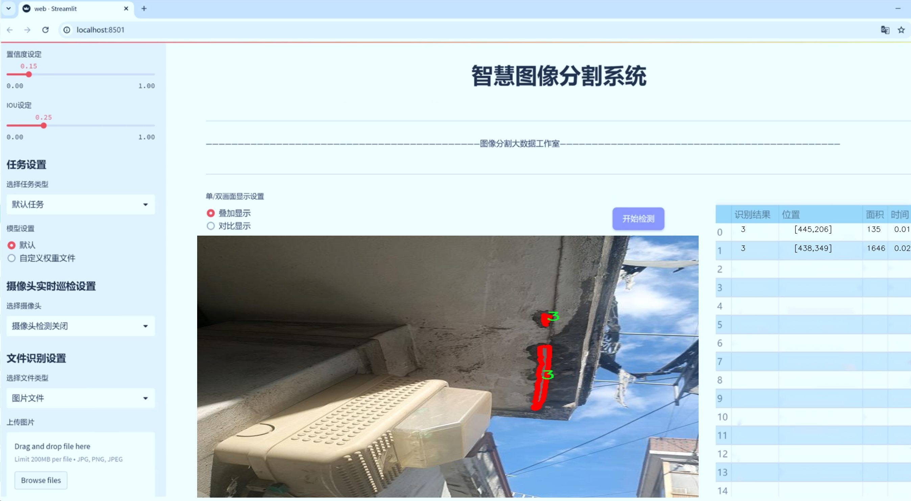
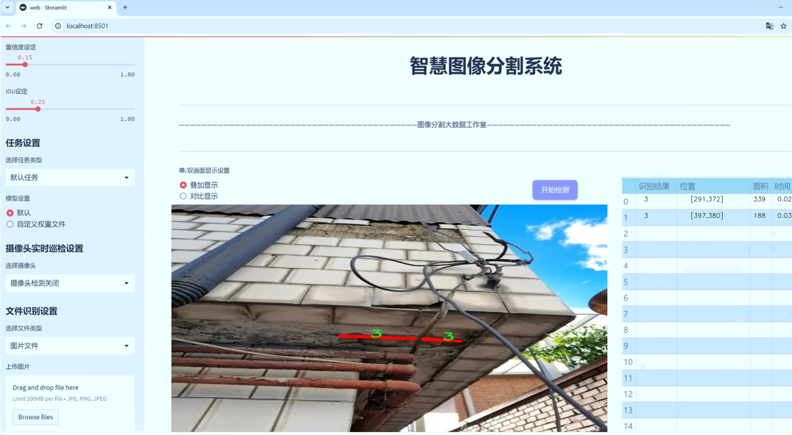
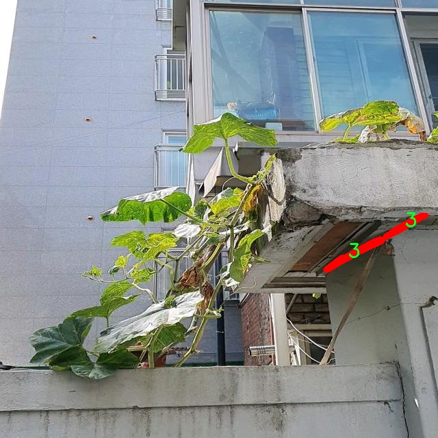
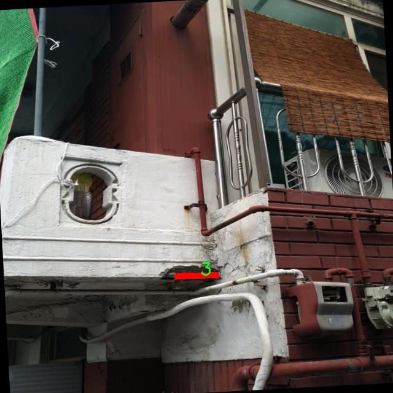
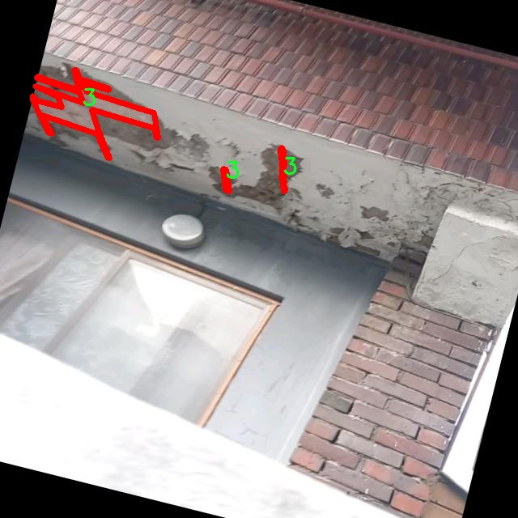
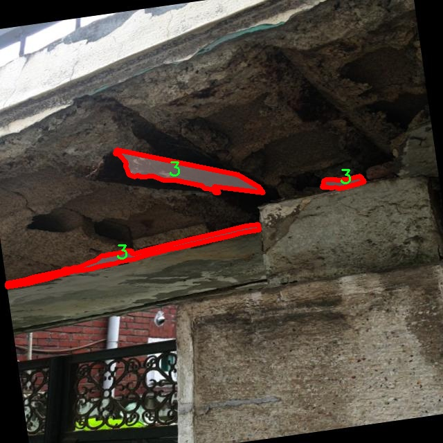
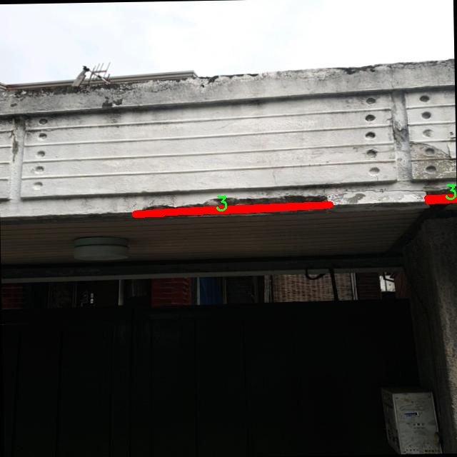

# 混凝土漏筋图像分割系统： yolov8-seg-C2f-ODConv

### 1.研究背景与意义

[参考博客](https://gitee.com/YOLOv8_YOLOv11_Segmentation_Studio/projects)

[博客来源](https://kdocs.cn/l/cszuIiCKVNis)

研究背景与意义

随着建筑行业的快速发展，混凝土结构的安全性和耐久性问题日益受到重视。混凝土漏筋现象，即混凝土中钢筋的暴露或缺失，可能导致结构强度下降，甚至引发严重的安全隐患。因此，及时、准确地检测和识别混凝土漏筋情况，对于确保建筑物的安全性至关重要。传统的人工检测方法不仅耗时耗力，而且容易受到人为因素的影响，导致漏检或误检现象的发生。因此，亟需一种高效、自动化的检测手段，以提高混凝土漏筋的检测精度和效率。

近年来，深度学习技术在计算机视觉领域取得了显著进展，尤其是在图像分割和目标检测任务中表现出色。YOLO（You Only Look Once）系列模型因其高效的实时检测能力而广泛应用于各类视觉任务。YOLOv8作为该系列的最新版本，进一步提升了检测精度和速度，适合用于复杂场景下的图像分析。然而，针对混凝土漏筋的具体应用，YOLOv8模型仍存在一定的局限性，尤其是在细粒度分割和复杂背景下的表现。因此，基于YOLOv8的改进方法，构建一个专门针对混凝土漏筋的图像分割系统，具有重要的研究价值和实际意义。

本研究旨在开发一个基于改进YOLOv8的混凝土漏筋图像分割系统，利用2200张标注图像的数据集进行训练和测试。该数据集包含两个类别的目标，分别为漏筋和正常钢筋，通过对这些图像的深入分析，可以提取出混凝土漏筋的特征信息，为后续的自动化检测提供基础。通过改进YOLOv8模型，增强其在漏筋图像分割任务中的表现，能够有效提高漏筋检测的准确性和鲁棒性。此外，利用实例分割技术，可以实现对漏筋位置的精确定位，为后续的修复和维护提供重要依据。

在实际应用中，构建的混凝土漏筋图像分割系统不仅可以大幅度提高检测效率，降低人工成本，还能为建筑行业提供更为可靠的安全保障。通过自动化的检测手段，能够及时发现混凝土结构中的潜在问题，减少因漏筋导致的安全事故发生。此外，该系统的研究成果也将为相关领域的学术研究提供新的思路和方法，推动计算机视觉技术在建筑工程中的应用。

综上所述，基于改进YOLOv8的混凝土漏筋图像分割系统的研究，不仅具有重要的理论意义，也具有广泛的实际应用前景。通过本研究，期望能够为混凝土结构的安全检测提供一种高效、准确的解决方案，推动建筑行业的智能化发展，提升整体工程质量和安全水平。

### 2.图片演示






注意：本项目提供完整的训练源码数据集和训练教程,由于此博客编辑较早,暂不提供权重文件（best.pt）,需要按照6.训练教程进行训练后实现上图效果。

### 3.视频演示

[3.1 视频演示](https://www.bilibili.com/video/BV15M6NY5ELx/)

### 4.数据集信息

##### 4.1 数据集类别数＆类别名

nc: 2
names: ['2', '3']


##### 4.2 数据集信息简介

数据集信息展示

在构建和训练改进YOLOv8-seg的混凝土漏筋图像分割系统的过程中，数据集的选择和构建至关重要。本项目所使用的数据集名为“rebar_add”，该数据集专门针对混凝土结构中钢筋的可视化检测与分割而设计，旨在提高模型在复杂环境下的表现和准确性。数据集包含两类主要目标，分别为“2”和“3”，这两类代表了不同类型的钢筋漏筋情况。通过对这两类的深入分析与标注，数据集为模型提供了丰富的训练样本，确保其在实际应用中的有效性。

“rebar_add”数据集的构建过程中，数据采集团队在多个建筑工地和实验室环境中收集了大量的混凝土图像。这些图像不仅涵盖了不同的光照条件、角度和背景，还包括了各种混凝土表面状态下的钢筋漏筋情况。这种多样性使得数据集能够有效地模拟现实世界中的各种挑战，为模型的训练提供了更为全面的样本基础。

在数据标注方面，采用了先进的图像标注工具，对每一张图像中的钢筋漏筋情况进行了精确的标注。标注过程中，专业的标注团队结合领域知识，对每一类目标进行了细致的划分和标记，确保数据集的高质量和高准确性。这种精细化的标注不仅提高了模型的训练效率，也为后续的模型评估提供了可靠的依据。

数据集的类别数量为2，分别对应于不同的漏筋情况。类别“2”可能代表了较为常见的漏筋现象，而类别“3”则可能指向更为复杂或严重的漏筋情况。这种分类设计不仅有助于模型学习不同类型漏筋的特征，也为后续的分析和应用提供了便利。通过对这两类的训练，模型能够更好地理解和识别不同漏筋情况的特征，从而在实际应用中实现更高的准确率和召回率。

此外，数据集的规模和样本数量也经过精心设计，以确保模型在训练过程中能够获得足够的样本多样性和丰富性。通过不断扩展和更新数据集，研究团队致力于提高模型的泛化能力，使其能够在未见过的图像中也能保持良好的性能。

在数据集的使用过程中，研究人员还将进行一系列的预处理和增强操作，以进一步提升模型的训练效果。这些操作包括图像的旋转、缩放、裁剪以及颜色调整等，旨在增加数据集的多样性，减少模型对特定样本的过拟合现象。

综上所述，“rebar_add”数据集为改进YOLOv8-seg的混凝土漏筋图像分割系统提供了坚实的基础。通过高质量的标注、多样化的样本和精细的分类设计，该数据集不仅提升了模型的训练效果，也为未来的研究和应用提供了广阔的空间。随着数据集的不断扩展和优化，研究团队期待在混凝土结构检测领域取得更为显著的成果。











### 5.项目依赖环境部署教程（零基础手把手教学）

[5.1 环境部署教程链接（零基础手把手教学）](https://www.bilibili.com/video/BV1jG4Ve4E9t/?vd_source=bc9aec86d164b67a7004b996143742dc)


[5.2 安装Python虚拟环境创建和依赖库安装视频教程链接（零基础手把手教学）](https://www.bilibili.com/video/BV1nA4VeYEze/?vd_source=bc9aec86d164b67a7004b996143742dc)

### 6.手把手YOLOV8-seg训练视频教程（零基础手把手教学）

[6.1 手把手YOLOV8-seg训练视频教程（零基础小白有手就能学会）](https://www.bilibili.com/video/BV1cA4VeYETe/?vd_source=bc9aec86d164b67a7004b996143742dc)


按照上面的训练视频教程链接加载项目提供的数据集，运行train.py即可开始训练



     Epoch   gpu_mem       box       obj       cls    labels  img_size
     1/200     0G   0.01576   0.01955  0.007536        22      1280: 100%|██████████| 849/849 [14:42<00:00,  1.04s/it]
               Class     Images     Labels          P          R     mAP@.5 mAP@.5:.95: 100%|██████████| 213/213 [01:14<00:00,  2.87it/s]
                 all       3395      17314      0.994      0.957      0.0957      0.0843

     Epoch   gpu_mem       box       obj       cls    labels  img_size
     2/200     0G   0.01578   0.01923  0.007006        22      1280: 100%|██████████| 849/849 [14:44<00:00,  1.04s/it]
               Class     Images     Labels          P          R     mAP@.5 mAP@.5:.95: 100%|██████████| 213/213 [01:12<00:00,  2.95it/s]
                 all       3395      17314      0.996      0.956      0.0957      0.0845

     Epoch   gpu_mem       box       obj       cls    labels  img_size
     3/200     0G   0.01561    0.0191  0.006895        27      1280: 100%|██████████| 849/849 [10:56<00:00,  1.29it/s]
               Class     Images     Labels          P          R     mAP@.5 mAP@.5:.95: 100%|███████   | 187/213 [00:52<00:00,  4.04it/s]
                 all       3395      17314      0.996      0.957      0.0957      0.0845


### 7.50+种全套YOLOV8-seg创新点加载调参实验视频教程（一键加载写好的改进模型的配置文件）

[7.1 50+种全套YOLOV8-seg创新点加载调参实验视频教程（一键加载写好的改进模型的配置文件）](https://www.bilibili.com/video/BV1Hw4VePEXv/?vd_source=bc9aec86d164b67a7004b996143742dc)

### YOLOV8-seg算法简介

原始YOLOv8-seg算法原理

YOLOv8-seg算法是2023年由Ultralytics推出的一款先进的目标检测与分割模型，它在YOLO系列算法的基础上进行了深度优化，结合了多种前沿技术，旨在实现更高效的目标检测和图像分割。YOLOv8-seg不仅延续了YOLO系列的实时性和高精度特点，还在网络结构和训练策略上进行了创新，使其在各种应用场景中表现出色。

YOLOv8-seg的网络结构主要分为三个部分：Backbone、Neck和Head。Backbone部分负责特征提取，采用了一系列卷积和反卷积层，这些层通过残差连接和瓶颈结构的设计，有效地减小了网络的参数量，同时提升了模型的性能。具体而言，Backbone部分由多个CBS模块、C2f模块以及一个快速空间金字塔池化（SPPF）模块构成。CBS模块的设计使得特征提取过程更加高效，而C2f模块则通过引入更多的特征通道，增强了模型对复杂特征的捕捉能力。SPPF模块的引入，使得模型能够在不同尺度上进行特征融合，从而提高了对多尺度目标的检测能力。

在Neck部分，YOLOv8-seg采用了多尺度特征融合技术，旨在将来自Backbone不同阶段的特征图进行有效整合。这一过程通过跨层连接和特征金字塔网络（FPN）的设计，使得模型能够更好地捕捉不同尺度目标的信息，显著提升了目标检测的性能和鲁棒性。通过这种方式，YOLOv8-seg能够在处理不同大小和形状的目标时，保持较高的检测精度。

Head部分则是YOLOv8-seg的核心，负责最终的目标检测和分类任务。该部分设有多个检测头，分别用于处理不同尺寸的信息。这些检测头通过一系列卷积层和反卷积层，生成最终的检测结果。值得注意的是，YOLOv8-seg在Head部分引入了新的标签分配策略和损失函数设计，这些改进使得模型在训练过程中能够更好地学习到目标的特征，提高了模型的收敛速度和检测精度。

YOLOv8-seg的训练过程也体现了其创新性。它采用了多尺度训练和测试策略，使得模型在不同的输入尺寸下都能保持较高的性能。此外，YOLOv8-seg还引入了一些新的数据增强技术，进一步提升了模型的泛化能力。这些技术的结合，使得YOLOv8-seg在各种复杂场景下都能实现高效的目标检测和分割。

与之前的YOLO版本相比，YOLOv8-seg在精度和速度上都有显著提升。通过与SSD等传统目标检测算法的比较，YOLOv8-seg不仅在精度上提高了43.23%，而且在帧率上也有了10.28倍的提升。这一切都使得YOLOv8-seg成为了实时检测领域的一个重要里程碑。

YOLOv8-seg的应用范围广泛，包括智能监控、自动驾驶、医疗影像分析等多个领域。在苹果采摘的应用中，YOLOv8-seg能够有效地识别和定位苹果，为自动采摘机器人提供精准的视觉信息。同时，结合蚁群算法进行路径规划，进一步提升了采摘效率。

总之，YOLOv8-seg算法的原理和设计理念展示了其在目标检测和分割领域的强大能力。通过创新的网络结构、有效的特征融合技术以及先进的训练策略，YOLOv8-seg不仅提高了检测精度和速度，还为未来的研究和应用提供了新的方向。随着YOLOv8-seg的不断发展和完善，我们有理由相信，它将在目标检测领域继续引领潮流，推动相关技术的进步。


### 9.系统功能展示（检测对象为举例，实际内容以本项目数据集为准）

图9.1.系统支持检测结果表格显示

  图9.2.系统支持置信度和IOU阈值手动调节

  图9.3.系统支持自定义加载权重文件best.pt(需要你通过步骤5中训练获得)

  图9.4.系统支持摄像头实时识别

  图9.5.系统支持图片识别

  图9.6.系统支持视频识别

  图9.7.系统支持识别结果文件自动保存

  图9.8.系统支持Excel导出检测结果数据


### 10.50+种全套YOLOV8-seg创新点原理讲解（非科班也可以轻松写刊发刊，V11版本正在科研待更新）

#### 10.1 由于篇幅限制，每个创新点的具体原理讲解就不一一展开，具体见下列网址中的创新点对应子项目的技术原理博客网址【Blog】：


[10.1 50+种全套YOLOV8-seg创新点原理讲解链接](https://gitee.com/qunmasj/good)

#### 10.2 部分改进模块原理讲解(完整的改进原理见上图和技术博客链接)【如果此小节的图加载失败可以通过CSDN或者Github搜索该博客的标题访问原始博客，原始博客图片显示正常】

### YOLOv8简介
YOLOv8是一种目标检测模型，是基于YOLO (You Only Look Once)系列算法发展而来的最新版本。它的核心思想是将目标检测任务转化为一个回归问题，通过单次前向传播即可直接预测出图像中的多个目标的位置和类别。
YOLOv8的网络结构采用了Darknet作为其主干网络，主要由卷积层和池化层构成。与之前的版本相比，YOLOv8在网络结构上进行了改进，引入了更多的卷积层和残差模块，以提高模型的准确性和鲁棒性。
YOLOv8采用了一种特征金字塔网络(Feature Pyramid Network,FPN)的结构，通过在不同层级上融合多尺度的特征信息，可以对不同尺度的目标进行有效的检测。此外，YOLOv8还引入了一种自适应感知域(Adaptive Anchors
的机制，通过自适应地学习目标的尺度和
长宽比，提高了模型对于不同尺度和形状目标的检测效果。
总体来说，YOLOv8结构模型综合了多个先进的目标检测技术，在保证检测速度的同时提升了检测精度和鲁棒性，被广泛应用于实时目标检测任务中。


#### yolov8网络模型结构图

YOLOv8 (You Only Look Once version 8)是一种目标检测算法，它在实时场景下可以快速准确地检测图像中的目标。
YOLOv8的网络模型结构基于Darknet框架，由一系列卷积层、池化层和全连接层组成。主要包含以下几个组件:
1.输入层:接收输入图像。
2.卷积层:使用不同尺寸的卷积核来提取图像特征。
3.残差块(Residual blocks):通过使用跳跃连接(skip connections）来解决梯度消失问题，使得网络更容易训练。
4.上采样层(Upsample layers):通过插值操作将特征图的尺寸放大，以便在不同尺度上进行目标检测。
5.池化层:用于减小特征图的尺寸，同时保留重要的特征。
6.1x1卷积层:用于降低通道数，减少网络参数量。
7.3x3卷积层:用于进—步提取和组合特征。
8.全连接层:用于最后的目标分类和定位。
YOLOv8的网络结构采用了多个不同尺度的特征图来检测不同大小的目标，从而提高了目标检测的准确性和多尺度性能。
请注意，YOLOv8网络模型结构图的具体细节可能因YOLO版本和实现方式而有所不同。


#### yolov8模型结构
YOLOv8模型是一种目标检测模型，其结构是基于YOLOv3模型进行改进的。模型结构可以分为主干网络和检测头两个部分。
主干网络是一种由Darknet-53构成的卷积神经网络。Darknet-53是一个经过多层卷积和残差连接构建起来的深度神经网络。它能够提取图像的特征信息，并将这些信息传递给检测头。
检测头是YOLOv8的关键部分，它负责在图像中定位和识别目标。检测头由一系列卷积层和全连接层组成。在每个检测头中，会生成一组锚框，并针对每个锚框预测目标的类别和位置信息。
YOLOv8模型使用了预训练的权重，其中在COCO数据集上进行了训练。这意味着该模型已经通过大规模数据集的学习，具有一定的目标检测能力。

### RT-DETR骨干网络HGNetv2简介
#### RT-DETR横空出世
前几天被百度的RT-DETR刷屏，参考该博客提出的目标检测新范式对原始DETR的网络结构进行了调整和优化，以提高计算速度和减小模型大小。这包括使用更轻量级的基础网络和调整Transformer结构。并且，摒弃了nms处理的detr结构与传统的物体检测方法相比，不仅训练是端到端的，检测也能端到端，这意味着整个网络在训练过程中一起进行优化，推理过程不需要昂贵的后处理代价，这有助于提高模型的泛化能力和性能。


当然，人们对RT-DETR之所以产生浓厚的兴趣，我觉得大概率还是对YOLO系列审美疲劳了，就算是出到了YOLO10086，我还是只想用YOLOv5和YOLOv7的框架来魔改做业务。。

#### 初识HGNet
看到RT-DETR的性能指标，发现指标最好的两个模型backbone都是用的HGNetv2，毫无疑问，和当时的picodet一样，骨干都是使用百度自家的网络。初识HGNet的时候，当时是参加了第四届百度网盘图像处理大赛，文档图像方向识别专题赛道，简单来说，就是使用分类网络对一些文档截图或者图片进行方向角度分类。


当时的方案并没有那么快定型，通常是打榜过程发现哪个网络性能好就使用哪个网络做魔改，而且木有显卡，只能蹭Ai Studio的平台，不过v100一天8小时的实验时间有点短，这也注定了大模型用不了。 

流水的模型，铁打的炼丹人，最后发现HGNet-tiny各方面指标都很符合我们的预期，后面就一直围绕它魔改。当然，比赛打榜是目的，学习才是享受过程，当时看到效果还可以，便开始折腾起了HGNet的网络架构，我们可以看到，PP-HGNet 针对 GPU 设备，对目前 GPU 友好的网络做了分析和归纳，尽可能多的使用 3x3 标准卷积（计算密度最高），PP-HGNet是由多个HG-Block组成，细节如下：


ConvBNAct是啥？简单聊一聊，就是Conv+BN+Act，CV Man应该最熟悉不过了：
```python
class ConvBNAct(TheseusLayer):
    def __init__(self,
                 in_channels,
                 out_channels,
                 kernel_size,
                 stride,
                 groups=1,
                 use_act=True):
        super().__init__()
        self.use_act = use_act
        self.conv = Conv2D(
            in_channels,
            out_channels,
            kernel_size,
            stride,
            padding=(kernel_size - 1) // 2,
            groups=groups,
            bias_attr=False)
        self.bn = BatchNorm2D(
            out_channels,
            weight_attr=ParamAttr(regularizer=L2Decay(0.0)),
            bias_attr=ParamAttr(regularizer=L2Decay(0.0)))
        if self.use_act:
            self.act = ReLU()
 
    def forward(self, x):
        x = self.conv(x)
        x = self.bn(x)
        if self.use_act:
            x = self.act(x)
        return x 
```
且标准卷积的数量随层数深度增加而增多，从而得到一个有利于 GPU 推理的骨干网络，同样速度下，精度也超越其他 CNN ，性价比也优于ViT-base模型。


另外，我们可以看到：

PP-HGNet 的第一层由channel为96的Stem模块构成，目的是为了减少参数量和计算量。PP-HGNet

Tiny的整体结构由四个HG Stage构成，而每个HG Stage主要由包含大量标准卷积的HG Block构成。

PP-HGNet的第三到第五层使用了使用了可学习的下采样层（LDS Layer），该层group为输入通道数，可达到降参降计算量的作用，且Tiny模型仅包含三个LDS Layer，并不会对GPU的利用率造成较大影响.

PP-HGNet的激活函数为Relu，常数级操作可保证该模型在硬件上的推理速度。

### 11.项目核心源码讲解（再也不用担心看不懂代码逻辑）

#### 11.1 ultralytics\trackers\basetrack.py

以下是对代码的核心部分进行提炼和详细注释的结果：

```python
# Ultralytics YOLO 🚀, AGPL-3.0 license

from collections import OrderedDict
import numpy as np

class TrackState:
    """跟踪状态的枚举类，表示对象的不同跟踪状态。"""
    New = 0      # 新创建的跟踪
    Tracked = 1  # 正在跟踪的状态
    Lost = 2     # 跟踪丢失
    Removed = 3  # 跟踪被移除

class BaseTrack:
    """对象跟踪的基类，处理基本的跟踪属性和操作。"""

    _count = 0  # 全局跟踪ID计数器

    track_id = 0          # 当前跟踪的ID
    is_activated = False   # 跟踪是否被激活
    state = TrackState.New # 当前跟踪状态

    history = OrderedDict() # 存储跟踪历史
    features = []           # 特征列表
    curr_feature = None     # 当前特征
    score = 0              # 跟踪分数
    start_frame = 0        # 跟踪开始的帧
    frame_id = 0           # 当前帧ID
    time_since_update = 0   # 自上次更新以来的时间

    # 多摄像头支持
    location = (np.inf, np.inf)  # 跟踪对象的位置，初始化为无穷大

    @property
    def end_frame(self):
        """返回跟踪的最后帧ID。"""
        return self.frame_id

    @staticmethod
    def next_id():
        """递增并返回全局跟踪ID计数器。"""
        BaseTrack._count += 1
        return BaseTrack._count

    def activate(self, *args):
        """激活跟踪，使用提供的参数。"""
        raise NotImplementedError  # 子类需要实现此方法

    def predict(self):
        """预测跟踪的下一个状态。"""
        raise NotImplementedError  # 子类需要实现此方法

    def update(self, *args, **kwargs):
        """使用新的观测值更新跟踪。"""
        raise NotImplementedError  # 子类需要实现此方法

    def mark_lost(self):
        """将跟踪标记为丢失。"""
        self.state = TrackState.Lost

    def mark_removed(self):
        """将跟踪标记为已移除。"""
        self.state = TrackState.Removed

    @staticmethod
    def reset_id():
        """重置全局跟踪ID计数器。"""
        BaseTrack._count = 0
```

### 代码分析与注释说明：

1. **TrackState 类**：
   - 该类定义了跟踪对象的不同状态，包括新建、正在跟踪、丢失和已移除。这些状态用于管理跟踪对象的生命周期。

2. **BaseTrack 类**：
   - 这是一个基类，负责管理跟踪对象的基本属性和操作。它包含了跟踪的ID、状态、历史记录、特征等信息。
   - `track_id`：每个跟踪对象的唯一标识符。
   - `is_activated`：指示跟踪对象是否已激活。
   - `state`：当前跟踪状态，初始为新建状态。
   - `history`：用于存储跟踪历史，使用有序字典保持顺序。
   - `features` 和 `curr_feature`：用于存储和管理跟踪对象的特征。
   - `score`：跟踪的置信度分数。
   - `start_frame` 和 `frame_id`：跟踪的起始帧和当前帧ID。
   - `time_since_update`：自上次更新以来的时间，帮助判断跟踪的有效性。
   - `location`：跟踪对象的位置，初始化为无穷大以表示未定义状态。

3. **方法**：
   - `end_frame`：返回跟踪的最后帧ID。
   - `next_id`：静态方法，用于生成新的跟踪ID。
   - `activate`、`predict`、`update`：这些方法需要在子类中实现，分别用于激活跟踪、预测下一个状态和更新跟踪信息。
   - `mark_lost` 和 `mark_removed`：用于标记跟踪对象的状态，便于后续处理。
   - `reset_id`：静态方法，用于重置全局跟踪ID计数器。

这个类设计为一个可扩展的基础类，其他具体的跟踪实现可以继承并实现其方法。

这个文件是一个用于对象跟踪的基础类实现，主要定义了跟踪状态和基本的跟踪操作。首先，文件中定义了一个枚举类 `TrackState`，它列出了可能的对象跟踪状态，包括新建（New）、跟踪中（Tracked）、丢失（Lost）和已移除（Removed）。这些状态用于描述一个跟踪对象在不同时间点的状态变化。

接下来，`BaseTrack` 类是一个用于对象跟踪的基类，负责处理基本的跟踪属性和操作。类中定义了一些类变量和实例变量。`_count` 是一个类变量，用于跟踪当前的跟踪ID数量。`track_id` 是当前跟踪对象的唯一标识符，`is_activated` 表示该跟踪对象是否已激活，`state` 则记录当前的跟踪状态，初始为新建状态。

`history` 是一个有序字典，用于存储跟踪历史，`features` 列表用于存储与跟踪对象相关的特征，`curr_feature` 是当前特征，`score` 表示跟踪的置信度分数，`start_frame` 和 `frame_id` 分别表示跟踪开始的帧和当前帧的ID，`time_since_update` 用于记录自上次更新以来的时间。

此外，`location` 属性用于多摄像头跟踪，初始化为无穷大，表示尚未确定位置。类中还定义了一个属性 `end_frame`，用于返回跟踪的最后一帧ID。

`BaseTrack` 类中包含了一些静态方法和实例方法。`next_id` 方法用于递增并返回全局跟踪ID计数器，`activate`、`predict` 和 `update` 方法是需要在子类中实现的抽象方法，分别用于激活跟踪、预测下一个状态和更新跟踪信息。`mark_lost` 和 `mark_removed` 方法用于将跟踪对象标记为丢失或已移除。

最后，`reset_id` 静态方法用于重置全局跟踪ID计数器。这些功能为后续的具体跟踪实现提供了基础，允许开发者在此基础上扩展具体的跟踪算法和逻辑。

#### 11.2 ultralytics\models\nas\predict.py

以下是经过简化和注释的核心代码部分：

```python
import torch
from ultralytics.engine.predictor import BasePredictor
from ultralytics.engine.results import Results
from ultralytics.utils import ops

class NASPredictor(BasePredictor):
    """
    Ultralytics YOLO NAS 预测器，用于目标检测。

    该类扩展了 Ultralytics 引擎中的 `BasePredictor`，负责对 YOLO NAS 模型生成的原始预测结果进行后处理。
    它应用了非极大值抑制（NMS）和将边界框缩放到原始图像尺寸等操作。

    属性:
        args (Namespace): 包含各种后处理配置的命名空间。
    """

    def postprocess(self, preds_in, img, orig_imgs):
        """对预测结果进行后处理，并返回结果对象的列表。"""

        # 将预测框转换为 xywh 格式（左上角和右下角坐标转换为中心点和宽高）
        boxes = ops.xyxy2xywh(preds_in[0][0])
        
        # 将边界框和类分数合并，并调整维度
        preds = torch.cat((boxes, preds_in[0][1]), -1).permute(0, 2, 1)

        # 应用非极大值抑制，过滤掉重叠的框
        preds = ops.non_max_suppression(preds,
                                        self.args.conf,  # 置信度阈值
                                        self.args.iou,   # IOU 阈值
                                        agnostic=self.args.agnostic_nms,  # 是否对类别无关
                                        max_det=self.args.max_det,  # 最大检测数量
                                        classes=self.args.classes)  # 指定的类别

        # 如果输入图像不是列表，则将其转换为 numpy 数组
        if not isinstance(orig_imgs, list):
            orig_imgs = ops.convert_torch2numpy_batch(orig_imgs)

        results = []  # 存储结果的列表
        for i, pred in enumerate(preds):
            orig_img = orig_imgs[i]  # 获取原始图像
            # 将预测框缩放到原始图像的尺寸
            pred[:, :4] = ops.scale_boxes(img.shape[2:], pred[:, :4], orig_img.shape)
            img_path = self.batch[0][i]  # 获取图像路径
            # 创建结果对象并添加到结果列表中
            results.append(Results(orig_img, path=img_path, names=self.model.names, boxes=pred))
        
        return results  # 返回处理后的结果列表
```

### 代码注释说明：
1. **类定义**：`NASPredictor` 类继承自 `BasePredictor`，用于 YOLO NAS 模型的后处理。
2. **postprocess 方法**：该方法负责对模型的原始预测结果进行后处理，包括：
   - 将预测框从 `xyxy` 格式转换为 `xywh` 格式。
   - 合并边界框和类别分数，并进行维度调整。
   - 应用非极大值抑制（NMS）来去除重叠的框。
   - 将输入图像转换为 numpy 数组（如果不是列表）。
   - 对每个预测结果进行缩放，并创建结果对象，最后返回结果列表。

这个程序文件 `ultralytics\models\nas\predict.py` 定义了一个名为 `NASPredictor` 的类，该类用于处理 YOLO NAS 模型生成的原始预测结果，主要用于目标检测任务。该类继承自 `BasePredictor`，并实现了对预测结果的后处理功能。

在 `NASPredictor` 类中，主要包含一个方法 `postprocess`，该方法的作用是对输入的预测结果进行后处理，返回一个包含处理后结果的列表。后处理的过程包括几个关键步骤：

首先，方法接收三个参数：`preds_in`（原始预测结果）、`img`（输入图像）和 `orig_imgs`（原始图像）。然后，它通过调用 `ops.xyxy2xywh` 函数将预测框的坐标从 (x1, y1, x2, y2) 格式转换为 (x_center, y_center, width, height) 格式，并将类别分数与边界框信息进行拼接，形成一个新的张量 `preds`。

接下来，使用 `ops.non_max_suppression` 函数对预测结果进行非极大值抑制（NMS），以去除冗余的边界框。该函数的参数包括置信度阈值、IOU阈值、是否使用类别无关的 NMS、最大检测数量以及指定的类别。

在处理完预测结果后，方法检查 `orig_imgs` 是否为列表。如果不是，则将其转换为 NumPy 数组格式，以便后续处理。然后，方法遍历每个预测结果，使用 `ops.scale_boxes` 函数将边界框的坐标缩放到原始图像的尺寸，并将处理后的结果与原始图像路径、类别名称等信息一起封装到 `Results` 对象中。

最后，方法返回一个包含所有处理后结果的列表。这个类通常不会被直接实例化，而是在 `NAS` 类内部使用。整体上，该文件的目的是为 YOLO NAS 模型提供一个高效的后处理工具，以便于用户获取最终的目标检测结果。

#### 11.3 ultralytics\data\loaders.py

以下是代码中最核心的部分，并附上详细的中文注释：

```python
import cv2
import numpy as np
import torch
from pathlib import Path
from threading import Thread
from urllib.parse import urlparse

class LoadStreams:
    """
    用于加载视频流的类，支持多种类型的视频流输入。

    属性:
        sources (str): 视频流的输入路径或URL。
        imgsz (int): 处理的图像大小，默认为640。
        vid_stride (int): 视频帧率步幅，默认为1。
        running (bool): 指示流线程是否正在运行的标志。
        imgs (list): 每个流的图像帧列表。
        fps (list): 每个流的FPS列表。
        frames (list): 每个流的总帧数列表。
        threads (list): 每个流的线程列表。
        shape (list): 每个流的形状列表。
        caps (list): 每个流的cv2.VideoCapture对象列表。
    """

    def __init__(self, sources='file.streams', imgsz=640, vid_stride=1):
        """初始化流加载器的实例变量，并检查输入流形状的一致性。"""
        self.running = True  # 线程运行标志
        self.imgsz = imgsz  # 图像大小
        self.vid_stride = vid_stride  # 视频帧率步幅
        sources = Path(sources).read_text().rsplit() if os.path.isfile(sources) else [sources]
        self.sources = [x.strip() for x in sources]  # 清理源名称
        n = len(self.sources)
        self.imgs, self.fps, self.frames, self.threads, self.shape = [[]] * n, [0] * n, [0] * n, [None] * n, [[]] * n
        self.caps = [None] * n  # 视频捕获对象

        for i, s in enumerate(self.sources):  # 遍历每个源
            self.caps[i] = cv2.VideoCapture(s)  # 存储视频捕获对象
            if not self.caps[i].isOpened():
                raise ConnectionError(f'无法打开视频源: {s}')
            w = int(self.caps[i].get(cv2.CAP_PROP_FRAME_WIDTH))
            h = int(self.caps[i].get(cv2.CAP_PROP_FRAME_HEIGHT))
            fps = self.caps[i].get(cv2.CAP_PROP_FPS)  # 获取FPS
            self.frames[i] = max(int(self.caps[i].get(cv2.CAP_PROP_FRAME_COUNT)), 0) or float('inf')  # 获取总帧数
            self.fps[i] = max((fps if fps > 0 else 30), 30)  # 设置FPS的默认值为30

            success, im = self.caps[i].read()  # 读取第一帧
            if not success or im is None:
                raise ConnectionError(f'无法读取视频源的图像: {s}')
            self.imgs[i].append(im)  # 存储第一帧图像
            self.shape[i] = im.shape  # 存储图像形状
            self.threads[i] = Thread(target=self.update, args=([i, self.caps[i], s]), daemon=True)  # 启动线程读取帧
            self.threads[i].start()

    def update(self, i, cap, stream):
        """在守护线程中读取流的帧。"""
        while self.running and cap.isOpened():
            success, im = cap.read()  # 读取图像
            if success:
                self.imgs[i].append(im)  # 存储图像
            else:
                break  # 如果读取失败，退出循环

    def close(self):
        """关闭流加载器并释放资源。"""
        self.running = False  # 停止线程
        for thread in self.threads:
            if thread.is_alive():
                thread.join(timeout=5)  # 等待线程结束
        for cap in self.caps:  # 释放视频捕获对象
            cap.release()
        cv2.destroyAllWindows()  # 关闭所有OpenCV窗口

    def __iter__(self):
        """返回迭代器对象。"""
        self.count = -1
        return self

    def __next__(self):
        """返回源路径、转换后的图像和原始图像以供处理。"""
        self.count += 1
        images = []
        for i, x in enumerate(self.imgs):
            while not x:  # 等待帧可用
                time.sleep(0.01)
                x = self.imgs[i]
            images.append(x.pop(0))  # 获取并移除第一帧
        return self.sources, images, None, ''

    def __len__(self):
        """返回源对象的长度。"""
        return len(self.sources)  # 返回源的数量
```

### 代码核心部分说明：
1. **LoadStreams类**：该类用于加载和处理视频流，支持多种视频源（如RTSP、RTMP、HTTP等）。
2. **__init__方法**：初始化视频流的基本参数，并启动线程读取视频帧。
3. **update方法**：在后台线程中持续读取视频帧，并将其存储在图像列表中。
4. **close方法**：关闭所有打开的视频流并释放资源。
5. **__iter__和__next__方法**：实现迭代器协议，允许在每次迭代中返回最新的视频帧。

这段代码的主要功能是从指定的视频源读取帧，并在需要时提供这些帧以供后续处理。

这个程序文件是Ultralytics YOLO模型的一个重要组成部分，主要负责加载各种类型的数据源，包括视频流、图像、截图和张量数据，以便进行目标检测等任务。文件中定义了多个类，每个类负责不同类型的数据加载。

首先，`SourceTypes`类用于表示输入源的不同类型，如网络摄像头、截图、图像文件和张量。接下来，`LoadStreams`类用于处理视频流的加载，支持RTSP、RTMP、HTTP和TCP等多种流媒体协议。它的构造函数初始化了一些参数，包括图像大小、视频帧率步幅和缓冲设置，并尝试打开每个视频源。如果视频源是YouTube链接，程序会通过`get_best_youtube_url`函数获取最佳质量的视频流地址。该类还包含一个`update`方法，用于在后台线程中读取视频帧，并在`__next__`方法中返回处理后的图像。

`LoadScreenshots`类则专注于处理屏幕截图，允许用户指定要捕获的屏幕区域，并使用`mss`库进行屏幕捕获。它的`__next__`方法返回捕获的屏幕图像。

`LoadImages`类负责加载图像和视频文件，支持从多种格式的文件中读取数据。它的构造函数会检查文件路径是否有效，并根据文件类型创建相应的图像或视频对象。`__next__`方法根据当前的文件类型返回图像或视频帧。

`LoadPilAndNumpy`类用于从PIL图像和Numpy数组中加载图像数据，确保图像格式正确并转换为Numpy数组。它的`_single_check`方法用于验证和格式化单个图像。

`LoadTensor`类则专注于从PyTorch张量中加载图像数据，确保输入张量的形状和数据范围符合要求。

此外，文件中还定义了一个`autocast_list`函数，用于将不同类型的输入源合并为Numpy数组或PIL图像的列表。最后，`get_best_youtube_url`函数用于提取YouTube视频的最佳质量MP4流地址。

整体而言，这个文件为YOLO模型提供了灵活的数据加载能力，支持多种输入源的处理，方便用户进行目标检测和其他计算机视觉任务。

#### 11.4 ultralytics\models\rtdetr\__init__.py

以下是代码中最核心的部分，并附上详细的中文注释：

```python
# 导入必要的模块和类
from .model import RTDETR  # 从当前包中导入 RTDETR 模型类
from .predict import RTDETRPredictor  # 从当前包中导入 RTDETR 预测器类
from .val import RTDETRValidator  # 从当前包中导入 RTDETR 验证器类

# 定义当前模块的公开接口
__all__ = 'RTDETRPredictor', 'RTDETRValidator', 'RTDETR'  # 指定当使用 'from module import *' 时，允许导入的类
```

### 注释说明：
1. **导入模块**：
   - `from .model import RTDETR`：从当前包的 `model` 模块中导入 `RTDETR` 类，通常这个类是用于定义模型的结构和功能。
   - `from .predict import RTDETRPredictor`：从当前包的 `predict` 模块中导入 `RTDETRPredictor` 类，这个类通常用于对输入数据进行预测。
   - `from .val import RTDETRValidator`：从当前包的 `val` 模块中导入 `RTDETRValidator` 类，这个类通常用于验证模型的性能。

2. **定义公开接口**：
   - `__all__` 是一个特殊的变量，用于定义当使用 `from module import *` 时，哪些类或函数是可以被导入的。在这里，`RTDETRPredictor`、`RTDETRValidator` 和 `RTDETR` 被指定为可公开访问的接口。

这个程序文件是Ultralytics YOLO项目中的一部分，具体位于`ultralytics\models\rtdetr\__init__.py`。该文件的主要功能是定义模块的公共接口。

首先，文件顶部的注释部分提到该项目使用的是AGPL-3.0许可证，这是一种开源许可证，允许用户自由使用、修改和分发软件，但要求任何基于该软件的衍生作品也必须在相同许可证下发布。

接下来，文件通过`from .model import RTDETR`、`from .predict import RTDETRPredictor`和`from .val import RTDETRValidator`这三行代码，从同一目录下的其他模块中导入了三个类或对象：`RTDETR`、`RTDETRPredictor`和`RTDETRValidator`。这些导入的类或对象可能分别用于模型的定义、预测功能和验证功能。

最后，`__all__`变量被定义为一个元组，包含了三个字符串：`'RTDETRPredictor'`、`'RTDETRValidator'`和`'RTDETR'`。这个变量的作用是指明当使用`from module import *`语句时，哪些名称是可以被导入的。这有助于控制模块的公共接口，避免不必要的名称泄露。

总体来说，这个文件的作用是组织和简化RTDETR模型相关功能的导入，使得用户在使用该模块时更加方便。

#### 11.5 ultralytics\utils\__init__.py

以下是经过简化并添加详细中文注释的核心代码部分：

```python
import os
import platform
import logging
from pathlib import Path
import yaml

# 设置日志记录
def set_logging(name='ultralytics', verbose=True):
    """设置日志记录的配置"""
    level = logging.INFO if verbose else logging.ERROR  # 根据是否详细输出设置日志级别
    logging.basicConfig(level=level, format='%(message)s')  # 设置日志格式

# 保存YAML数据到文件
def yaml_save(file='data.yaml', data=None, header=''):
    """将数据以YAML格式保存到指定文件"""
    if data is None:
        data = {}
    file = Path(file)
    if not file.parent.exists():
        file.parent.mkdir(parents=True, exist_ok=True)  # 创建父目录

    # 将数据写入YAML文件
    with open(file, 'w', encoding='utf-8') as f:
        if header:
            f.write(header)  # 写入头部信息
        yaml.safe_dump(data, f, sort_keys=False, allow_unicode=True)  # 保存为YAML格式

# 从YAML文件加载数据
def yaml_load(file='data.yaml'):
    """从指定的YAML文件加载数据"""
    with open(file, encoding='utf-8') as f:
        return yaml.safe_load(f) or {}  # 返回加载的数据，若文件为空则返回空字典

# 检查操作系统是否为Ubuntu
def is_ubuntu() -> bool:
    """检查当前操作系统是否为Ubuntu"""
    return platform.system() == 'Linux' and 'ubuntu' in platform.version().lower()

# 获取用户配置目录
def get_user_config_dir(sub_dir='Ultralytics'):
    """获取用户配置目录"""
    if platform.system() == 'Windows':
        path = Path.home() / 'AppData' / 'Roaming' / sub_dir
    elif platform.system() == 'Darwin':  # macOS
        path = Path.home() / 'Library' / 'Application Support' / sub_dir
    else:  # Linux
        path = Path.home() / '.config' / sub_dir

    path.mkdir(parents=True, exist_ok=True)  # 创建目录
    return path

# 设置全局配置
USER_CONFIG_DIR = get_user_config_dir()  # 获取用户配置目录
SETTINGS_YAML = USER_CONFIG_DIR / 'settings.yaml'  # 配置文件路径
set_logging()  # 初始化日志记录

# 加载默认配置
DEFAULT_CFG_PATH = Path(__file__).resolve().parents[1] / 'cfg/default.yaml'  # 默认配置文件路径
DEFAULT_CFG_DICT = yaml_load(DEFAULT_CFG_PATH)  # 加载默认配置
```

### 代码说明：
1. **日志记录设置**：`set_logging`函数用于配置日志记录的级别和格式，便于后续调试和信息输出。
2. **YAML文件处理**：`yaml_save`和`yaml_load`函数分别用于将数据保存为YAML格式和从YAML文件中加载数据，方便配置管理。
3. **操作系统检查**：`is_ubuntu`函数用于判断当前操作系统是否为Ubuntu，以便于后续操作系统特定的处理。
4. **用户配置目录**：`get_user_config_dir`函数用于获取用户的配置目录，确保程序可以在合适的位置存储配置文件。
5. **全局配置**：最后部分代码用于初始化用户配置目录和加载默认配置，确保程序在启动时具备必要的配置。

这个程序文件是Ultralytics YOLO（You Only Look Once）项目的一部分，主要用于实现一些工具和功能，帮助用户更好地使用YOLO模型。文件中包含了多个模块和类，涉及到日志记录、配置管理、YAML文件的读写、线程安全、环境检测等功能。

首先，文件导入了一些必要的库，包括标准库和第三方库，如`torch`、`cv2`、`yaml`等。这些库提供了文件操作、数据处理、图像处理和深度学习等功能。

接下来，文件定义了一些常量，例如`RANK`和`LOCAL_RANK`用于多GPU训练的设置，`ROOT`和`ASSETS`用于指定项目的根目录和默认图像路径。还有一些与线程和日志相关的设置，例如`NUM_THREADS`和`VERBOSE`，这些设置可以通过环境变量进行调整。

文件中包含了一个帮助信息字符串`HELP_MSG`，提供了如何使用YOLO模型的示例，包括安装、使用Python SDK和命令行接口的方式。这些示例对新用户非常友好，能够帮助他们快速上手。

接着，文件定义了多个类和函数。`TQDM`类是对`tqdm`库的一个封装，提供了自定义的进度条显示功能。`SimpleClass`和`IterableSimpleNamespace`类提供了便捷的属性访问和调试信息显示功能，方便用户在使用过程中更好地理解对象的状态。

文件还定义了一些用于处理YAML文件的函数，如`yaml_save`和`yaml_load`，用于将数据保存为YAML格式或从YAML文件中加载数据。这些函数确保了数据的持久化和易读性。

在环境检测方面，文件提供了一系列函数，例如`is_ubuntu`、`is_colab`、`is_kaggle`等，用于检测当前运行环境。这些函数帮助用户了解代码的执行环境，从而进行相应的配置。

文件还实现了一个`SettingsManager`类，用于管理Ultralytics的设置。该类可以加载、保存和更新设置，确保用户的配置始终保持最新状态。

此外，文件中还定义了一些用于日志记录的功能，包括设置日志格式、过滤器和错误处理。通过`set_logging`函数，用户可以方便地配置日志记录的行为。

最后，文件中有一些实用的工具函数，如`colorstr`和`remove_colorstr`，用于处理字符串的颜色显示和去除颜色编码。这些工具函数在命令行输出中非常有用，能够提高用户体验。

总的来说，这个文件提供了YOLO模型使用过程中的多种实用工具和功能，旨在提高用户的使用效率和体验。通过这些工具，用户可以更方便地进行模型训练、评估和推理等操作。

### 12.系统整体结构（节选）

### 程序整体功能和构架概括

该程序是Ultralytics YOLO项目的一部分，主要用于目标检测和跟踪任务。整体架构由多个模块组成，每个模块负责特定的功能，以便于模型的训练、预测和数据处理。以下是各个模块的主要功能：

1. **跟踪模块** (`basetrack.py`): 提供了基础的对象跟踪类，定义了跟踪对象的状态和基本操作，便于后续具体跟踪算法的实现。
2. **预测模块** (`predict.py`): 处理YOLO NAS模型的预测结果，执行后处理以生成最终的检测结果，包括坐标转换和非极大值抑制。
3. **数据加载模块** (`loaders.py`): 提供多种数据源的加载功能，包括视频流、图像和张量，支持灵活的数据输入，方便进行目标检测。
4. **RTDETR模块** (`__init__.py`): 定义RTDETR模型的公共接口，导入相关类以便于用户使用模型进行预测和验证。
5. **工具模块** (`__init__.py`): 提供多种实用工具和功能，包括日志记录、配置管理、YAML文件处理、环境检测等，帮助用户更高效地使用YOLO模型。

### 文件功能整理表

| 文件路径                                      | 功能描述                                                                                     |
|-----------------------------------------------|----------------------------------------------------------------------------------------------|
| `ultralytics/trackers/basetrack.py`          | 定义基础跟踪类 `BaseTrack`，处理跟踪对象的状态和基本操作，支持后续具体跟踪算法的实现。        |
| `ultralytics/models/nas/predict.py`          | 处理YOLO NAS模型的预测结果，执行后处理（如坐标转换和非极大值抑制），返回最终检测结果。      |
| `ultralytics/data/loaders.py`                | 提供多种数据源的加载功能，包括视频流、图像和张量，支持灵活的数据输入，方便目标检测。      |
| `ultralytics/models/rtdetr/__init__.py`     | 定义RTDETR模型的公共接口，导入相关类（如 `RTDETR`、`RTDETRPredictor`、`RTDETRValidator`）。 |
| `ultralytics/utils/__init__.py`              | 提供多种实用工具和功能，包括日志记录、配置管理、YAML文件处理、环境检测等，提升用户体验。   |

通过这些模块的协同工作，Ultralytics YOLO项目能够高效地进行目标检测和跟踪任务，提供了灵活的接口和丰富的功能，便于用户进行各种计算机视觉应用。

### 13.图片、视频、摄像头图像分割Demo(去除WebUI)代码

在这个博客小节中，我们将讨论如何在不使用WebUI的情况下，实现图像分割模型的使用。本项目代码已经优化整合，方便用户将分割功能嵌入自己的项目中。
核心功能包括图片、视频、摄像头图像的分割，ROI区域的轮廓提取、类别分类、周长计算、面积计算、圆度计算以及颜色提取等。
这些功能提供了良好的二次开发基础。

### 核心代码解读

以下是主要代码片段，我们会为每一块代码进行详细的批注解释：

```python
import random
import cv2
import numpy as np
from PIL import ImageFont, ImageDraw, Image
from hashlib import md5
from model import Web_Detector
from chinese_name_list import Label_list

# 根据名称生成颜色
def generate_color_based_on_name(name):
    ......

# 计算多边形面积
def calculate_polygon_area(points):
    return cv2.contourArea(points.astype(np.float32))

...
# 绘制中文标签
def draw_with_chinese(image, text, position, font_size=20, color=(255, 0, 0)):
    image_pil = Image.fromarray(cv2.cvtColor(image, cv2.COLOR_BGR2RGB))
    draw = ImageDraw.Draw(image_pil)
    font = ImageFont.truetype("simsun.ttc", font_size, encoding="unic")
    draw.text(position, text, font=font, fill=color)
    return cv2.cvtColor(np.array(image_pil), cv2.COLOR_RGB2BGR)

# 动态调整参数
def adjust_parameter(image_size, base_size=1000):
    max_size = max(image_size)
    return max_size / base_size

# 绘制检测结果
def draw_detections(image, info, alpha=0.2):
    name, bbox, conf, cls_id, mask = info['class_name'], info['bbox'], info['score'], info['class_id'], info['mask']
    adjust_param = adjust_parameter(image.shape[:2])
    spacing = int(20 * adjust_param)

    if mask is None:
        x1, y1, x2, y2 = bbox
        aim_frame_area = (x2 - x1) * (y2 - y1)
        cv2.rectangle(image, (x1, y1), (x2, y2), color=(0, 0, 255), thickness=int(3 * adjust_param))
        image = draw_with_chinese(image, name, (x1, y1 - int(30 * adjust_param)), font_size=int(35 * adjust_param))
        y_offset = int(50 * adjust_param)  # 类别名称上方绘制，其下方留出空间
    else:
        mask_points = np.concatenate(mask)
        aim_frame_area = calculate_polygon_area(mask_points)
        mask_color = generate_color_based_on_name(name)
        try:
            overlay = image.copy()
            cv2.fillPoly(overlay, [mask_points.astype(np.int32)], mask_color)
            image = cv2.addWeighted(overlay, 0.3, image, 0.7, 0)
            cv2.drawContours(image, [mask_points.astype(np.int32)], -1, (0, 0, 255), thickness=int(8 * adjust_param))

            # 计算面积、周长、圆度
            area = cv2.contourArea(mask_points.astype(np.int32))
            perimeter = cv2.arcLength(mask_points.astype(np.int32), True)
            ......

            # 计算色彩
            mask = np.zeros(image.shape[:2], dtype=np.uint8)
            cv2.drawContours(mask, [mask_points.astype(np.int32)], -1, 255, -1)
            color_points = cv2.findNonZero(mask)
            ......

            # 绘制类别名称
            x, y = np.min(mask_points, axis=0).astype(int)
            image = draw_with_chinese(image, name, (x, y - int(30 * adjust_param)), font_size=int(35 * adjust_param))
            y_offset = int(50 * adjust_param)

            # 绘制面积、周长、圆度和色彩值
            metrics = [("Area", area), ("Perimeter", perimeter), ("Circularity", circularity), ("Color", color_str)]
            for idx, (metric_name, metric_value) in enumerate(metrics):
                ......

    return image, aim_frame_area

# 处理每帧图像
def process_frame(model, image):
    pre_img = model.preprocess(image)
    pred = model.predict(pre_img)
    det = pred[0] if det is not None and len(det)
    if det:
        det_info = model.postprocess(pred)
        for info in det_info:
            image, _ = draw_detections(image, info)
    return image

if __name__ == "__main__":
    cls_name = Label_list
    model = Web_Detector()
    model.load_model("./weights/yolov8s-seg.pt")

    # 摄像头实时处理
    cap = cv2.VideoCapture(0)
    while cap.isOpened():
        ret, frame = cap.read()
        if not ret:
            break
        ......

    # 图片处理
    image_path = './icon/OIP.jpg'
    image = cv2.imread(image_path)
    if image is not None:
        processed_image = process_frame(model, image)
        ......

    # 视频处理
    video_path = ''  # 输入视频的路径
    cap = cv2.VideoCapture(video_path)
    while cap.isOpened():
        ret, frame = cap.read()
        ......
```


### 14.完整训练+Web前端界面+50+种创新点源码、数据集获取


# [下载链接：https://mbd.pub/o/bread/Z5yVmZpt](https://mbd.pub/o/bread/Z5yVmZpt)